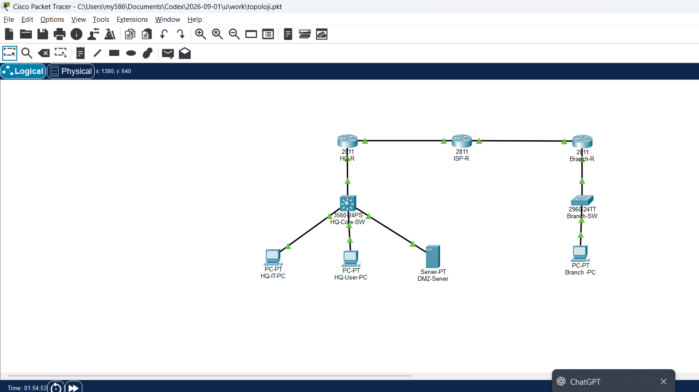

# HQ-Branch IPsec DMZ Network Topology

Cisco Packet Tracer topology demonstrating a routed HQ-to-Branch network with an ISP transit segment and a DMZ server network.



## Topology

```text
HQ LAN / Core Switch --- HQ-R --- ISP-R --- Branch-R --- Branch LAN
                              |
                         DMZ network
```

## Devices

- HQ-R: HQ edge router
- HQ-Core-SW: Layer 3 core switch
- ISP-R: ISP transit router
- Branch-R: Branch edge router
- HQ-IT-PC and HQ-User-PC: HQ client devices
- DMZ-Server: Server in the DMZ network
- Branch-PC: Branch client device

## Addressing

| Network or Interface | Address / Network |
| --- | --- |
| HQ-R to HQ-Core-SW | `10.10.0.0/30` |
| HQ-R to ISP-R | `203.0.113.0/30` |
| ISP-R to Branch-R | `198.51.100.0/30` |
| HQ user network | `10.10.10.0/24` |
| HQ IT network | `10.10.20.0/24` |
| DMZ network | `10.10.30.0/24` |
| Branch network | `10.20.40.0/24` |

## Key Hosts

- DMZ-Server: `10.10.30.10`, gateway `10.10.30.1`
- Branch-PC: `10.20.40.10`, gateway `10.20.40.1`

## Routing

The topology uses static routes across the routed links. The ISP router includes routes for both the HQ and Branch networks so traffic can travel in both directions.

## Verification

1. Open `HQ-Branch-IPsec-DMZ-Network-Topology.pkt` in Cisco Packet Tracer.
2. Confirm all required interfaces are up.
3. From Branch-PC, test the DMZ server:

   ```text
   ping 10.10.30.10
   ```

4. From DMZ-Server, test the Branch PC:

   ```text
   ping 10.20.40.10
   ```

Successful replies confirm end-to-end connectivity.

## Repository Contents

- `HQ-Branch-IPsec-DMZ-Network-Topology.pkt`: Cisco Packet Tracer topology file
- `README.md`: Project documentation and verification guide
